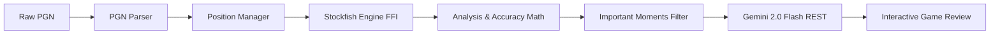

# ChessLens

[](https://flutter.dev)
[](https://dart.dev)
[](https://developer.android.com)
[](LICENSE)

> **Stockfish analyzes the chess. Gemini explains the chess.**

ChessLens is a modern, privacy-focused Flutter application for Android that delivers master-level game review with human explanations. Paste any chess game PGN, analyze every position locally using Stockfish through native FFI, classify mistakes and blunders using standard evaluation algorithms, and receive plain-English coaching explanations powered by your own Gemini API key—with zero intermediate servers and complete data privacy.

---

## Screenshots

| Home & Status | PGN Import | Quick Report |
| :---: | :---: | :---: |
| <br>_Home screen with API status & instant analysis_ | <br>_PGN input with real-time move validation_ | <br>_Accuracy scores, classification & eval graph_ |

| Interactive Review | Coach Explanation | Settings |
| :---: | :---: | :---: |
| <br>_Board review with eval bar & best-move arrow_ | <br>_Plain-English tactical explanations by Gemini_ | <br>_Engine depth, MultiPV & encrypted API key_ |

---

## Features

- **Local Stockfish Engine (Offline FFI)**: Evaluates positions directly on-device using a high-performance C++ Stockfish build via native FFI. No internet required for engine analysis.
- **Move Classification**: Automatically tags every move as **Best**, **Excellent**, **Good**, **Inaccuracy**, **Mistake**, or **Blunder** based on centipawn loss and MultiPV delta.
- **Lichess-Standard Accuracy Model**: Computes move-by-move and side-wide accuracy using standard win-probability sigmoid functions and exponential decay formulas.
- **Interactive Evaluation Trajectory**: Smooth, responsive evaluation graph mapping game momentum, critical moments, and selectable ply milestones.
- **AI Coach Reviews (BYO Key)**: Uses Google Gemini (`gemini-3.8-flash`) to generate concise, human-grade explanations of critical mistakes, why they failed, and what tactical ideas were missed.
- **Privacy First (No Middleman Server)**: Your Gemini API key is stored strictly on your device using hardware-backed Android KeyStore encryption (`flutter_secure_storage`). Requests travel directly between your phone and Google's official Gemini endpoint.
- **Responsive Layout**: Designed to adapt gracefully to compact screens (320dp), large devices, tablets, landscape orientations, and high accessibility font scaling (1.5×).

---

## How It Works



1. **Import & Validation**: The PGN parser parses headers, strips extraneous annotations, validates moves sequentially against chess rules, and records position FENs.
2. **Stockfish Engine Analysis**: `AnalysisManager` optimizes the search pipeline by evaluating each position once across $N + 1$ positions, keeping the engine transposition table active without clearing the hash.
3. **Move Classification & Accuracy**: Centipawn evaluations are converted to mover perspectives to compute centipawn loss and win-probability shifts.
4. **AI Coach Generation**: Positions exceeding importance thresholds are sent directly to the Gemini REST API with structured system instructions, generating actionable lessons.

---

## Architecture & Project Structure

ChessLens follows a modular, reactive architecture powered by `provider`:

```text
lib/
├── ai/                     # Gemini service, prompts, and secure API key manager
├── chess/                  # PGN parser and board position manager
├── core/
│   ├── config/             # Central AppConfig, settings manager, and constants
│   ├── game_controller.dart # Central coordination pipeline & UI viewmodel
│   └── theme/              # Dark mode design system and typography tokens
├── engine/                 # Stockfish FFI controller, analysis manager, and UCI parser
├── models/                 # Strongly-typed data models (ChessGame, MoveAnalysis, etc.)
├── screens/
│   ├── analysis/           # Interactive board review & landscape split layout
│   ├── home/               # Launcher dashboard with quick actions
│   ├── pgn_import/         # Text input and PGN file ingestion
│   ├── quick_report/       # Accuracy metrics & evaluation graph summary
│   ├── settings/           # Engine depth, MultiPV, and API key management
│   └── summary/            # Overall game performance narrative & takeaways
└── widgets/                # Reusable UI components (chess board, eval bar, move list, graph)
```

---

## Getting Started

### Prerequisites

- **Flutter SDK**: `^3.47.0` (Dart `^3.13.5`)
- **Android SDK**: API level 21 or higher (Android 5.0+)
- **Android NDK & CMake**: Required to compile the Stockfish C++ engine plugin under `packages/flutter_stockfish_plugin`.

### Installation

1. Clone the repository:
   ```bash
   git clone https://github.com/TheVee7/Chess-lens.git
   cd Chess-lens
   ```

2. Fetch project dependencies:
   ```bash
   flutter pub get
   ```

3. Run on an Android device or emulator:
   ```bash
   flutter run
   ```

4. Build a release APK:
   ```bash
   flutter build apk --release
   ```

---

## Gemini API Key Setup

To enable AI Coach explanations, you must provide your own Gemini API key:

1. Obtain a free API key from [Google AI Studio](https://aistudio.google.com/apikey).
2. Need assistance? Watch the [step-by-step setup guide](https://www.youtube.com/watch?v=o8iyrtQyrZM).
3. Open ChessLens, navigate to **Settings**, paste your key, and tap **Save & Verify Key**.

> **Privacy Notice**: ChessLens has no backend servers, accounts, or telemetry. Your API key is encrypted on your device using Android KeyStore via `flutter_secure_storage`. When AI Coach is active, only move SANs and evaluation metrics are transmitted directly to Google's Gemini API over HTTPS.

---

## Move Classification & Accuracy

### Centipawn Loss Thresholds

Move evaluations use centipawn loss from the player's perspective ($\max(0, \text{moverCp}_{\text{before}} - \text{moverCp}_{\text{after}})$):

| Classification | Symbol | Centipawn Loss ($\Delta cp$) | Description |
| :--- | :---: | :--- | :--- |
| **Best** | ✓ | $\Delta cp = 0$ (or MultiPV $\le 10$) | Top engine move or within 10 cp of optimal |
| **Excellent** | ✓ | $0 < \Delta cp \le 10$ | Very strong move maintaining advantage |
| **Good** | — | $10 < \Delta cp < 50$ | Solid move with minor positional concession |
| **Inaccuracy** | ?! | $50 \le \Delta cp < 100$ | Suboptimal choice weakening position |
| **Mistake** | ? | $100 \le \Delta cp < 200$ | Noticeable tactical or strategic blunder |
| **Blunder** | ?? | $\Delta cp \ge 200$ | Severe error shifting winning chances |

### Accuracy Formula

Move accuracy mirrors the standard Lichess win-percentage formula:

$$\text{win\%} = 50 + 50 \cdot \left( \frac{2}{1 + e^{-0.00368208 \cdot cp}} - 1 \right)$$

$$\text{Accuracy} = \operatorname{clamp}\left(103.1668 \cdot e^{-0.04354 \cdot (\text{win}_{\text{before}} - \text{win}_{\text{after}})} - 3.1669, \, 0, \, 100\right)$$

Game accuracy is aggregated per side using the arithmetic mean of all played moves.

---

## Configuration

Settings can be customized directly within `lib/core/config/app_config.dart` or via the in-app Settings screen:

| Setting | Default | Description |
| :--- | :--- | :--- |
| **Engine Depth** | `18` | Search depth per ply (10–24) |
| **MultiPV** | `2` | Number of concurrent principal variations analyzed |
| **Gemini Model** | `gemini-3.8-flash` | Current high-speed Google Gemini model ID |
| **Importance Threshold** | `40 cp` | Minimum loss required to trigger an AI coach explanation |

---

## Testing & Quality Assurance

Run the test suite:
```bash
flutter test
```

Run static analysis:
```bash
flutter analyze
```

---

## Troubleshooting

- **No Supported Devices Connected**: ChessLens relies on native Android FFI for Stockfish. It must be run on an Android device or emulator with ABI `arm64-v8a`, `armeabi-v7a`, or `x86_64`.
- **Engine Fails to Start**: Ensure your device supports the compiled NDK target. Clean build artifacts via `flutter clean && flutter pub get`.
- **429 Rate Limit Errors**: Free Gemini API tiers impose per-minute request quotas. ChessLens automatically caps explanation queues and performs exponential backoff.
- **Display Overflow on Custom Fonts**: ChessLens enforces adaptive scrolling and `FittedBox` scale guards to support text scaling up to 1.5×.

---

## Roadmap

- [ ] One-tap import from Lichess and Chess.com user profiles
- [ ] ECO opening book identifier & explorer
- [ ] Persistent game review history library
- [ ] Shareable review report cards (PDF & image export)
- [ ] Alternative board palettes and light mode

---

## Credits & Licenses

- **Stockfish Engine**: [Stockfish Team](https://stockfishchess.org) (Licensed under [GPL-3.0](https://www.gnu.org/licenses/gpl-3.0.html))
- **Chess Logic**: [`chess`](https://pub.dev/packages/chess) package
- **Typography**: [Google Fonts (Inter, JetBrains Mono)](https://fonts.google.com)
- **AI Explanations**: [Google Gemini API](https://ai.google.dev)

---

## License

This project is licensed under the **GNU General Public License v3.0** (GPL-3.0) to comply with the bundled Stockfish chess engine distribution requirements. See the [LICENSE](LICENSE) file for complete details.
